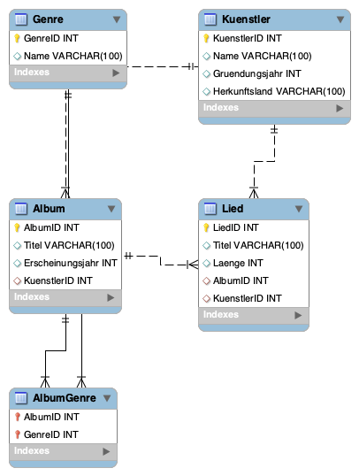
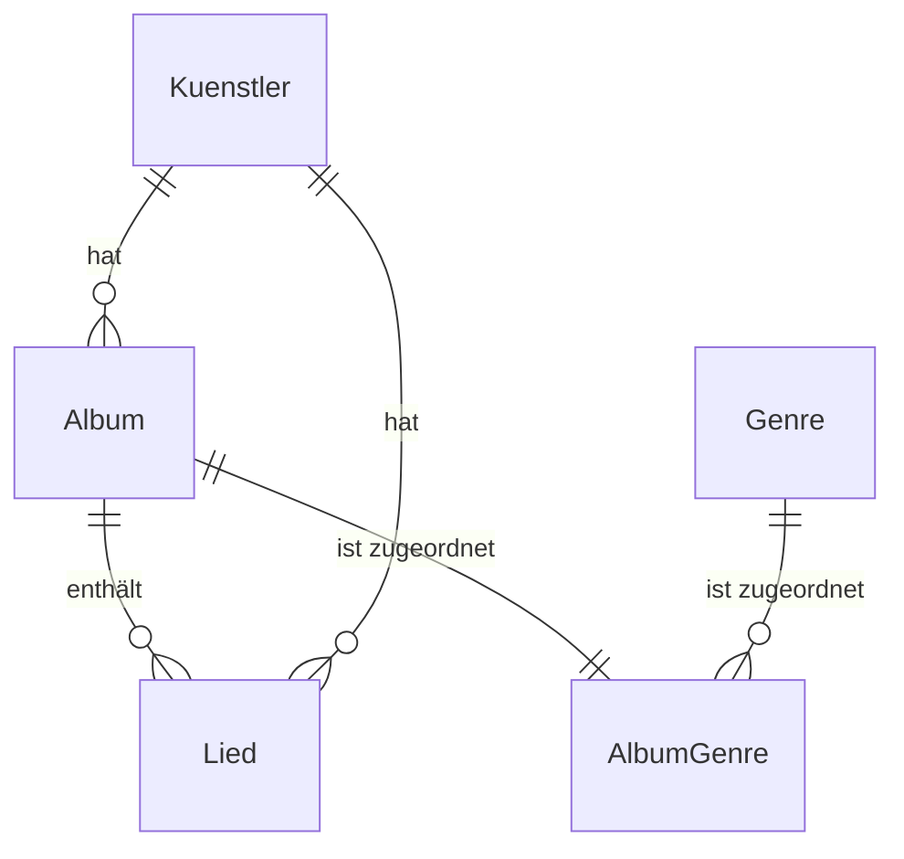

# Musiksammlungsdatenbank-Strukturierung

---

### Zielsetzung

Erstellung einer strukturierten und umfassenden Dokumentation für eine Musiksammlungsdatenbank, die sowohl die Datenbankstruktur als auch Beispieldaten und SQL-Code umfasst.

### Grundgedanke

Die Musiksammlungsdatenbank soll eine strukturierte Speicherung und Abfrage von Informationen zu Künstlern, Alben und Liedern ermöglichen.

### Durchführungsschritte

1. Definition der Tabellen und ihrer Attribute
2. Festlegung der Beziehungen zwischen den Tabellen
3. Erstellung von SQL-Code für die Datenbankstruktur
4. Einfügen von Beispiel-Datensätzen
5. Visualisierung der Datenbankstruktur mittels eines Entity-Relationship-Diagramms

### Anforderungen

- Ein Datenbankmanagementsystem (DBMS) muss vorhanden sein, um den SQL-Code auszuführen.
- Grundkenntnisse in SQL und Datenbankdesign sind erforderlich, um die Dokumentation zu verstehen und anzupassen.

### Beispiel

Die folgenden Codeblöcke und Tabellen stellen die Musiksammlungsdatenbank dar:

#### Tabellenstruktur

```markdown
#### Künstler
- KünstlerID: Eindeutige Identifikation des Künstlers (Primärschlüssel)
- Name: Name des Künstlers oder der Band
- Gründungsjahr: Jahr, in dem der Künstler oder die Band gegründet wurde
- Herkunftsland: Land, aus dem der Künstler oder die Band stammt

#### Album
- AlbumID: Eindeutige Identifikation des Albums (Primärschlüssel)
- Titel: Titel des Albums
- Erscheinungsjahr: Jahr, in dem das Album veröffentlicht wurde
- KünstlerID: Verweis auf den Künstler (Fremdschlüssel)

#### Lied
- LiedID: Eindeutige Identifikation des Liedes (Primärschlüssel)
- Titel: Titel des Liedes
- Länge: Länge des Liedes in Sekunden
- AlbumID: Verweis auf das Album (Fremdschlüssel)
- KünstlerID: Verweis auf den Künstler (Fremdschlüssel)

#### Genre
- GenreID: Eindeutige Identifikation des Genres (Primärschlüssel)
- Name: Name des Genres

#### AlbumGenre
- AlbumID: Verweis auf das Album (Teil des zusammengesetzten Primärschlüssels)
- GenreID: Verweis auf das Genre (Teil des zusammengesetzten Primärschlüssels)
```

#### Beispiel-Datensätze

```markdown
#### Tabelle "Künstler":
| KünstlerID | Name            | Gründungsjahr | Herkunftsland |
|------------|-----------------|---------------|---------------|
| 1          | The Beatles     | 1960          | UK            |
| 2          | Queen           | 1970          | UK            |
| 3          | Michael Jackson | 1964          | USA           |

#### Tabelle "Album":
| AlbumID | Titel                | Erscheinungsjahr | KünstlerID |
|---------|----------------------|------------------|------------|
| 1       | Abbey Road           | 1969             | 1          |
| 2       | A Night at the Opera | 1975             | 2          |
| 3       | Thriller             | 1982             | 3          |

#### Tabelle "Lied":
| LiedID | Titel              | Länge | AlbumID | KünstlerID |
|--------|--------------------|-------|---------|------------|
| 1      | Here Comes the Sun | 185   | 1       | 1          |
| 2      | Bohemian Rhapsody  | 354   | 2       | 2          |
| 3      | Billie Jean        | 294   | 3       | 3          |

#### Tabelle "Genre":
| GenreID | Name |
|---------|------|
| 1       | Rock |
| 2       | Pop  |
| 3       | R&B  |

#### Tabelle "AlbumGenre":
| AlbumID | GenreID |
|---------|---------|
| 1       | 1       |
| 2       | 1       |
| 3       | 2       |
```

#### SQL-Code für die Datenbankstruktur

```sql
-- Erstellen der Tabelle "Künstler"
CREATE TABLE Kuenstler (
    KuenstlerID INT PRIMARY KEY,
    Name VARCHAR(100),
    Gruendungsjahr INT,
    Herkunftsland VARCHAR(100)
);

-- Erstellen der Tabelle "Album"
CREATE TABLE Album (
    AlbumID INT PRIMARY KEY,
    Titel VARCHAR(100),
    Erscheinungsjahr INT,
    KuenstlerID INT,
    FOREIGN KEY (KuenstlerID) REFERENCES Kuenstler(KuenstlerID)
);

-- Erstellen der Tabelle "Lied"
CREATE TABLE Lied (
    LiedID INT PRIMARY KEY,
    Titel VARCHAR(100),
    Laenge INT,
    AlbumID INT,
    KuenstlerID INT,
    FOREIGN KEY (AlbumID) REFERENCES Album(AlbumID),
    FOREIGN KEY (KuenstlerID) REFERENCES Kuenstler(KuenstlerID)
);

-- Erstellen der Tabelle "Genre"
CREATE TABLE Genre (
    GenreID INT PRIMARY KEY,
    Name VARCHAR(100)
);

-- Erstellen der Verknüpfungstabelle "AlbumGenre"
CREATE TABLE AlbumGenre (
    AlbumID INT,
    GenreID INT,
    PRIMARY KEY (AlbumID, GenreID),
    FOREIGN KEY (AlbumID) REFERENCES Album(AlbumID),
    FOREIGN KEY (GenreID) REFERENCES Genre(GenreID)
);
```

#### Enhanced Entity-Relationship-Diagramm (EER)



#### Entity-Relationship-Diagramm (ERD)



### Offene Fragen

- Gibt es spezifische Anforderungen an die Normalisierung der Datenbank?
- Sollen zusätzliche Attribute wie Cover-Bilder oder Bewertungen hinzugefügt werden?
- Ist eine Erweiterung um weitere Entitäten wie Konzerte oder Playlists geplant?
